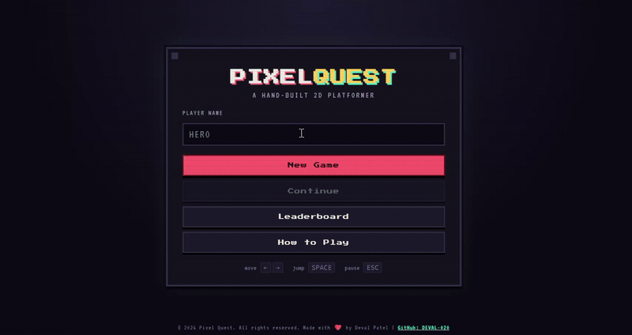

# Pixel Quest

A 2D platformer built with **Python (Flask)** on the backend and
**HTML / CSS / JavaScript (Canvas)** on the frontend.

## Features

- 3 hand-built levels (Grasslands → Caverns → Sky Fortress), each harder than the last
- Physics-based movement: run, jump, gravity, solid-platform collision
- Patrolling enemies — stomp them from above, or lose a heart on side contact
- Coins, score, and a 3-heart health system with brief invincibility after a hit
- Simple procedural animation (walk cycle, bob, pulsing goal flag) — no image assets required
- Sound effects synthesized live with the Web Audio API (jump, coin, stomp, hit, level clear)
- Pause menu (resume / restart level / save / quit)
- **Save & Continue**, stored locally in the browser so it works without a server
- **Leaderboard** — submit your final score and see the top 10 scores stored on the device
  
---

## Demo:



---

## Project structure

```
Pixel-Quest/
├── frontend/
│   ├── index.html      
│   ├── style.css        
│   ├── game.js          
│   └── assets/          
├── backend/
│   ├── app.py           
│   ├── database.db       
│   └── requirements.txt      
├── README.md
└── .gitignore
```

## Running it

```bash
cd backend
python -m venv venv
source venv/bin/activate      # Windows: venv\Scripts\activate
pip install -r requirements.txt
python app.py
```

Then open **http://localhost:5000** in your browser.

The database file is created automatically the first time the server starts —
you don't need to set anything up manually.

## Controls

| Action | Keys |
|---|---|
| Move | `←` `→` or `A` `D` |
| Jump | `Space`, `↑`, or `W` |
| Pause | `Esc` or `P` |

## Author: Deval Patel
